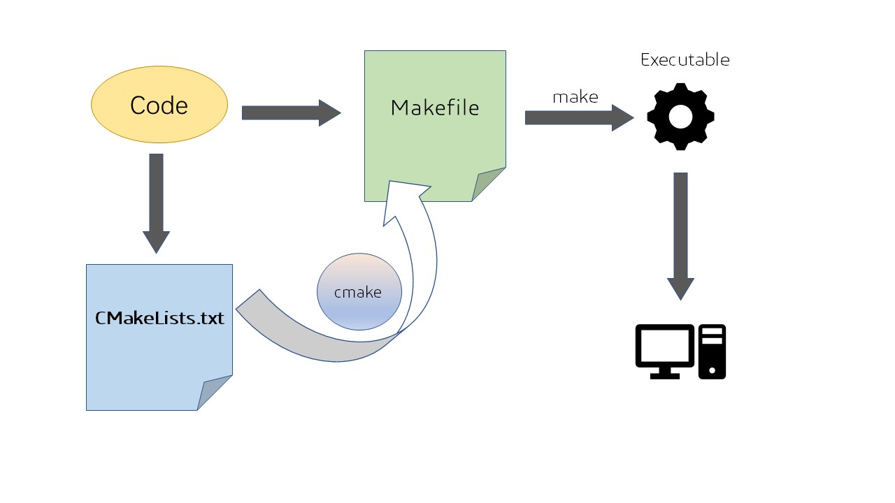

# 算法组第二次培训

> 第二节课将带领大家了解ROS2中的基础通信机制,具体包括话题(Topic)节点(node)通信的使用、如何构建ROS2节点，CMake构建工具的使用等内容。通过实践，我们将编写两个C++程序：一个Publisher（发布者）和一个Listener（订阅者）,并附带讲解GitHub的一些使用,帮助大家快速游走开源社区!

## Introduce -- CMake

在上节课,我们学习使用了g++编译程序,可能同学们初学觉得用g++编译简单快捷,但实际上,在较大工程项目的编写过程往往需要引入许多库,包括连接静态库,动态库等,用g++编译经常会出现`No such file or directory` 找不到库的情况,小的项目可能只有几个includes路径,无伤大雅,但是大项目下,成百上千的引用显然是不切实际的,因此CMake make 孕育而生


### 以 Hello RM 为例子展示

#### 新建工作空间 
```shell
mkdir -p ./CLASS_2/Task1/src/
mkdir -p ./CLASS_2/Task1/includes/
mkdir -p ./CLASS_2/Task1/tools/
cd ./CLASS_2/Task1/src/
```

#### 没有CMake时候

```
.
├── includes
│   └── hello.hpp
├── src
│   └── cmake.cpp
└── tools
    └── hello.cpp
```
 
- hello.hpp

```cpp
#ifndef HELLO_HPP
// 如果HELLO_HPP没有被定义，则编译以下代码
// 这是一种防止头文件被多次包含的常见技术，称为包含保护
#define HELLO_HPP   
// 定义HELLO_HPP
class Hello 
{ 
    // 定义一个名为Hello的类
private:
    // 私有成员变量和成员函数的声明区域
    /* data */
    // 这里可以放置私有数据成员，但目前为空
public:
    // 公有成员函数的声明区域
    void hello_rm(/* args */);
    // 声明一个公有成员函数hello_rm，函数参数列表为空，返回类型为void
    // 具体实现将在类的定义体外部进行
}; 

#endif 
```

- hello.cpp

```cpp
#include <iostream>
// #include "../includes/hello.hpp"
#include "hello.hpp"

void Hello::hello_rm() { // 定义Hello类的成员函数hello_rm
    std::cout << "Hello, RM !" << std::endl; // 输出字符串"Hello, RM !"到标准输出流
}

```

- cmake.cpp
```cpp
#include <iostream> // 包含标准输入输出库
#include "hello.hpp" // 包含自定义的头文件hello.hpp

int main() {     // 主函数入口
    Hello hello; // 创建Hello类的实例
    hello.hello_rm(); // 调用Hello类的hello_rm方法
    return 0;    // 返回0，表示程序正常结束
}
```

一般情况,用g++编写需要指明include

```shell
g++ ./src/cmake.cpp ./tools/hello.cpp -I ./includes/ -o cmake_exe
# 执行
./cmake_exe
```
输出 hello RM!

因为此时include还很少,我们可以手动添加,当路径较多时候,我们就需要加一长串文件,为简化操作,我们用cmake 和 make

#### CMake and make 操作

<!--  -->


<!-- 
 -->



> CMake通过调用CMakeLists.txt直接生成Makefile !

所以我们就只需要学习编写CMakeLists.txt即可


> 安装 CMake make

```shell
sudo apt install make cmake
```

在VScode安装CMake插件

```
.
├── cmake_exe
├── CMakeLists.txt
├── includes
│   └── hello.hpp
├── src
│   └── cmake.cpp
└── tools
    └── hello.cpp
```

- CMakeLists.txt

```s
# 指定CMake的最低版本要求
cmake_minimum_required(VERSION 3.11)

# 定义项目名称
project(CLASS_2)

# 添加头文件目录
include_directories(./includes)

# 添加可执行文件，并指定源文件
add_executable(cmake_exe src/cmake.cpp tools/hello.cpp)

```

运行cmake

```shell
cmake -B build 
make -C build # cd build && make
./build/cmake_exe
```

- 通过cmake运行CMakeLists.txt, -B参数 指定生成build文件夹
- make进入build,运行makefile, -C参数 进入build文件夹
- 最后运行可执行文件

可以直接复制如下到终端,一键实现

```shell
mkdir build 
cd build 
cmake .. && make -j
./cmake_exe
```

### 快速获取源文件

在CMakeLists.txt文件中,有些时候源文件非常的多,这时我们可以用 `aux_source_directory` 函数一键获取某一路径下的所有源文件

- CMakeLists.txt
```s
cmake_minimum_required(VERSION 3.11)

project(Task_2)

include_directories(./includes)

aux_source_directory(./tools TOOLS)
# 保存至TOOLS变量

add_executable(cmake_exe src/cmake.cpp ${TOOLS} )

#查看一下变量里面有什么
message(${TOOLS})

```

运行 
```shell
cmake -B build
```

输出 `./tools/hello.cpp` 源文件的目录

## ROS2节点与话题通信

在这篇博客中，我们将学习如何在ROS2中进行节点通信，特别是话题（Topic）通信。ROS2采用了发布-订阅模式，使得多个节点可以通过话题（Topic）进行数据交换。我们将动手编写两个简单的节点，一个发布消息，另一个订阅消息。通过这个实践，大家将能够更好地理解ROS2的通信机制。

### ROS2架构与通信模型

ROS2采用了“发布-订阅”模式，基本组件包括：

- **节点（Node）**：ROS2中每个独立的程序模块称为节点。每个节点可以发布和订阅消息，执行特定任务。
- **话题（Topic）**：话题是一个通信媒介，节点可以将消息发布到话题，其他节点可以从该话题订阅消息。
- **服务（Service）**：服务是一种基于请求-响应的通信模式，通常用于客户端和服务器之间的交互。
- **动作（Action）**：动作是一种长期运行任务的通信模式，可以中断任务并返回结果。

ROS2中三种主要的通信模式：

- **发布/订阅（Publish/Subscribe）**：通过话题实现，适用于一对多的通信。
- **服务/客户端（Service/Client）**：通过请求/响应方式实现，适用于一对一的通信。
- **动作（Action）**：适用于长期任务处理，需要反馈和中断的场景。

---

### 创建ROS2工作空间

在开始编码之前，我们需要创建一个ROS2工作空间。假设你的ROS2已经安装好并且工作正常，我们可以通过以下步骤来创建工作空间。

打开终端，执行以下命令：

```bash
mkdir -p ~/CLASS_2/Task2/src/
cd ~/CLASS_2/Task2/src/
# colcon build
```


### 编写Publisher和Listener节点 (C++)

进入src目录并创建包

在`src`目录下创建一个基于C++的ROS2包，执行以下命令：

```bash
cd ~/CLASS_2/Task2/src/
ros2 pkg create --build-type ament_cmake Publisher2Listener
```

这将创建一个名为`Publisher2Listener`的ROS2包。

#### 编写Publisher节点

在`src`目录下创建`publisher.cpp`文件，内容如下：

```cpp
#include <rclcpp/rclcpp.hpp>
#include <std_msgs/msg/string.hpp>

using namespace std::chrono_literals;

class PublisherNode : public rclcpp::Node
{
public:
    PublisherNode() : Node("publisher_node")
    {
        publisher_ = this->create_publisher<std_msgs::msg::String>("welcome_topic", 10);
        timer_ = this->create_wall_timer(
            1s, std::bind(&PublisherNode::timer_callback, this));  // 每秒发布一次消息
    }

private:
    void timer_callback()
    {
        auto message = std_msgs::msg::String();
        message.data = "Welcome to RM!";  // 发布的消息
        publisher_->publish(message);
        RCLCPP_INFO(this->get_logger(), "Publishing: '%s'", message.data.c_str());
    }

    rclcpp::Publisher<std_msgs::msg::String>::SharedPtr publisher_;
    rclcpp::TimerBase::SharedPtr timer_;
};

int main(int argc, char **argv)
{
    rclcpp::init(argc, argv);
    rclcpp::spin(std::make_shared<PublisherNode>());
    rclcpp::shutdown();
    return 0;
}
```

#### 编写Listener节点

同样，在`src`目录下创建`listener.cpp`文件，内容如下：

```cpp
#include <rclcpp/rclcpp.hpp>
#include <std_msgs/msg/string.hpp>

class ListenerNode : public rclcpp::Node
{
public:
    ListenerNode() : Node("listener_node")
    {
        subscription_ = this->create_subscription<std_msgs::msg::String>(
            "welcome_topic", 10, std::bind(&ListenerNode::listener_callback, this, std::placeholders::_1));
    }

private:
    void listener_callback(const std_msgs::msg::String::SharedPtr msg) const
    {
        RCLCPP_INFO(this->get_logger(), "Received: '%s'", msg->data.c_str());
    }

    rclcpp::Subscription<std_msgs::msg::String>::SharedPtr subscription_;
};

int main(int argc, char **argv)
{
    rclcpp::init(argc, argv);
    rclcpp::spin(std::make_shared<ListenerNode>());
    rclcpp::shutdown();
    return 0;
}
```

#### 配置CMake

ROS2使用CMake来构建项目。接下来，我们需要配置`CMakeLists.txt`文件，以便正确编译和链接我们的C++代码。

打开`Publisher2Listener/CMakeLists.txt`，修改内容如下：

```cmake
cmake_minimum_required(VERSION 3.11)
project(Publisher2Listener)

# ROS2相关的CMake依赖
find_package(rclcpp REQUIRED)
find_package(std_msgs REQUIRED)

add_executable(publisher_node src/publisher.cpp)
ament_target_dependencies(publisher_node rclcpp std_msgs)

add_executable(listener_node src/listener.cpp)
ament_target_dependencies(listener_node rclcpp std_msgs)

install(TARGETS
  publisher_node
  listener_node
  DESTINATION lib/${PROJECT_NAME})

ament_package()
```

> 说明：
- `find_package(rclcpp REQUIRED)`和`find_package(std_msgs REQUIRED)`：用于查找ROS2的核心包和标准消息包。
- `add_executable(publisher_node src/publisher.cpp)`：将C++源文件编译成可执行文件。
- `ament_target_dependencies(publisher_node rclcpp std_msgs)`：指定构建时的依赖项。

---


> 删除 ROS2 的包 (直接rm -rf即可)

```shell
rm -rf Publisher2Listener
```

### 编写Publisher和Listener节点 (Python)

进入src目录并创建包

在`src`目录下创建一个基于C++的ROS2包，执行以下命令：

```bash
cd ~/CLASS_2/Task2/src/
ros2 pkg create --build-type ament_python Publisher2Listener
```

这将创建一个名为`Publisher2Listener`的ROS2包。


#### Publisher节点

我们将创建一个Publisher节点，发布字符串消息 `Welcome to RM!`到一个话题`/welcome_topic`。创建一个Python文件`publisher.py`，在`Publisher2Listener`包的`Publisher2Listener`文件夹下：

```python
# publisher.py
import rclpy
from rclpy.node import Node
from std_msgs.msg import String

class PublisherNode(Node):
    def __init__(self):
        super().__init__('publisher_node')
        self.publisher_ = self.create_publisher(String, 'welcome_topic', 10)
        self.timer = self.create_timer(1.0, self.timer_callback)  # 每秒发布一次消息
        self.get_logger().info("Publisher node has started.")

    def timer_callback(self):
        msg = String()
        msg.data = "Welcome to RM!"  # 发布的消息
        self.publisher_.publish(msg)
        self.get_logger().info(f"Publishing: '{msg.data}'")

def main(args=None):
    rclpy.init(args=args)
    publisher_node = PublisherNode()
    rclpy.spin(publisher_node)
    rclpy.shutdown()

if __name__ == '__main__':
    main()
```

- `create_publisher`方法用于创建一个发布器，这里我们选择了`String`类型的消息，话题名为`/welcome_topic`，队列大小为10。
- `create_timer`方法用于定时调用`timer_callback`方法，每秒发布一次消息。

#### Listener节点

接下来我们编写Listener节点，订阅`/welcome_topic`话题并打印接收到的消息。创建一个Python文件`listener.py`，在`Publisher2Listener`包的`Publisher2Listener`文件夹下：

```python
# listener.py
import rclpy
from rclpy.node import Node
from std_msgs.msg import String

class ListenerNode(Node):
    def __init__(self):
        super().__init__('listener_node')
        self.subscription = self.create_subscription(
            String,
            'welcome_topic',
            self.listener_callback,
            10)
        self.get_logger().info("Listener node has started.")

    def listener_callback(self, msg):
        self.get_logger().info(f"Received: '{msg.data}'")

def main(args=None):
    rclpy.init(args=args)
    listener_node = ListenerNode()
    rclpy.spin(listener_node)
    rclpy.shutdown()

if __name__ == '__main__':
    main()
```

- `create_subscription`方法用于创建一个订阅器，订阅`/welcome_topic`话题。接收到消息时，调用`listener_callback`方法处理数据。

#### setup.py and package.xml

> 编辑`setup.py`

在`Publisher2Listener`目录下找到并编辑`setup.py`文件，确保添加了`Publisher2Listener`包的依赖：

```python
from setuptools import setup

package_name = 'Publisher2Listener'

setup(
    name=package_name,
    version='0.0.0',
    packages=[package_name],
    data_files=[
        ('share/ament_index/resource_index/packages',
            ['resource/' + package_name]),
        ('share/' + package_name, ['package.xml']),
    ],
    install_requires=['setuptools', 'rclpy', 'std_msgs'],
    zip_safe=True,
    maintainer='Whaltze',
    maintainer_email='2260274457@qq.com',
    description='ROS2 Publisher and Listener Example',
    license='Apache License 2.0',
    tests_require=['pytest'],
    entry_points={
        'console_scripts': [
            'publisher = Publisher2Listener.publisher:main',
            'listener = Publisher2Listener.listener:main',
        ],
    },
)
```

> 编辑`package.xml`

确保在`package.xml`中添加了所需的依赖项：

```xml
<exec_depend>rclpy</exec_depend>
<exec_depend>std_msgs</exec_depend>
```

### 编译和运行

在工作空间根目录下运行以下命令：

```bash
cd ./src
colcon build 
source install/setup.bash
```

分别打开两个终端，启动Publisher和Listener：

> 首先一定要记得 source 一下环境

```shell
source install/setup.bash
```

1. 启动Publisher节点：

```bash
ros2 run Publisher2Listener publisher
```

2. 启动Listener节点：

```bash
ros2 run Publisher2Listener listener
```

你将看到Listener节点在接收到Publisher节点发送的消息“Welcome to RM！”后，输出如下日志：

```shell
Received: 'Welcome to RM!'
```

### 报错 No executable found

- source install/setup.bash
- 检查 CMakeLists.txt 文件是否配置正确
- 使用命令 `ros2 pkg executables Publisher2Listener` 查看确保输入正确


> 总结

通过这次练习，我们成功地创建了ROS2节点，一个作为Publisher，另一个作为Listener。学习如何创建节点、话题以及如何通过ROS2的发布-订阅模型进行数据传递。这是ROS2中非常常见的通信方式之一，未来你将会用到更多类似的通信机制来构建更复杂的系统。

希望大家在接下来的学习中能够掌握这些基本概念，深入理解ROS2的通信架构。如果有任何问题，欢迎随时向我提问！

## 作业

1. 阐述ros架构以及话题节点服务等之间的通信关系
2. 动手编写一个listener和publisher，发布信息为welcome to RM！
3. 提供rqt截图
4. 写一个readme，告诉我如何运行你的节点（命令行）
5. 作业上传至CLASS仓库,且需符合提交规范