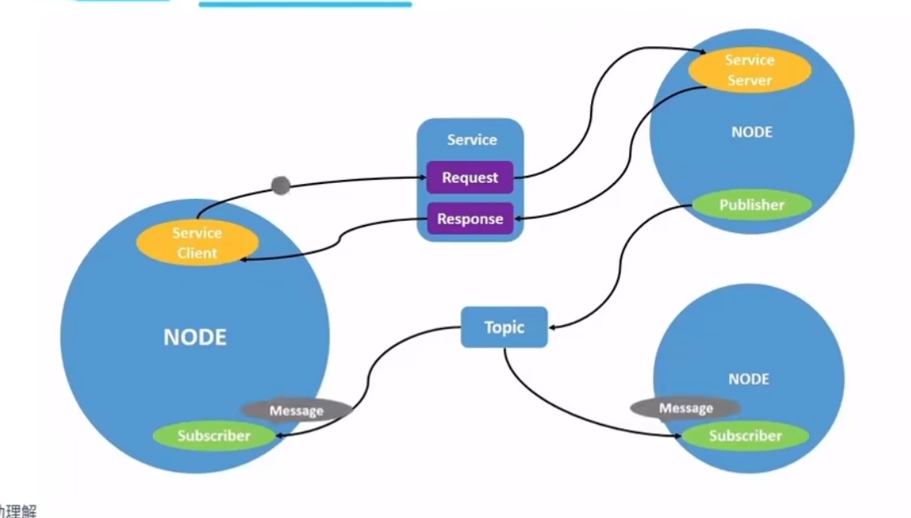

# 第二次任务
**学习目标**
> 1. 阐述ros架构以及话题节点服务等之间的通信关系
> 2. 动手编写一个listener和publisher，发布信息 为welcome to RM！
> 3. 提供rqt截图
## 1.ros架构
根据<https://fishros.com/d2lros2/#/humble/chapt1/advanced/1.ROS2%E7%B3%BB%E7%BB%9F%E6%9E%B6%E6%9E%84>
### 1. 架构图

### 2. 操作系统层

    ROS2本身就是基于Linux、Windows或者macOS系统建立的，驱动计算机硬件、底层网络通信等实现都是交由操作系统来实现的
### 3. DDS实现层  
    * DDS，全称 Data Distribution Service (数据分发服务)。是由对象管理组 (OMG) 于 2003 年发布并于 2007 年修订的开分布式系统标准。
    * 通过类似于ROS中的话题发布和订阅形式来进行通信，同时提供了丰富的服务质量管理来保证可靠性、持久性、传输设置等。
    * DDS实现层其实就是对不同常见的DDS接口进行再次的封装，让其保持统一性，为DDS抽象层提供统一的API。
### 4. 抽象DDS层-RMW  
    这一层将DDS实现层进一步的封装，使得DDS更容易使用。原因在于DDS需要大量的设置和配置（分区，主题名称，发现模式，消息创建,...），这些设置都是在ROS2的抽象层中完成的。
### 5. ROS2客户端库 RCL

    RCL（ROS Client Library）ROS客户端库，其实就是ROS的一种API，提供了对ROS话题、服务、参数、Action等接口。
    * GUI（Graphical User Interface）就是平常我们说的图形用户界面
    * CLI（Command-Line Interface）就是命令行界面了，我们所用的终端，黑框框就是命令行界面，没有图形化。
    * API（ Application Programming Interface）应用程序编程接口。在c中表现为头文件。  

    ROS的客户端库就是上面所说的RCL，不同的语言对应着不同的rcl，但基本功能都是相同的。

    比如Python语言提供了rclpy来操作ROS2的节点话题服务等，而C++则使用rclcpp提供API操作ROS2的节点话题和服务等。

    所以后面我们使用Python和C++来编写ROS2节点实现通讯等功能时，我们就会引入rclpy和rclcpp的库。 
### 6. 应用层

    应用层就是我们写代码以及ROS2开发的各种常用的机器人相关开发工具所在的层了。后面我们写的所有代码其实都是属于这一层的。
***
## 2. ROS2话题节点服务等之间的通信关系
### 通信的目的

通信的目的是在计算机系统中实现不同组件、进程或设备之间的信息和数据传递。通过通信，各个实体可以共享信息、协调行动并实现协同工作。在计算机领域，通信是构建分布式系统、网络和协议的基础。
### 通信原理

通信的原理涉及两个主要方面：通信协议和通信方式。通信协议定义了数据的格式、传输方式、错误检测和纠正等规则，以确保可靠的数据传输。通信方式涉及了不同的通信介质和技术，包括网络通信和进程间通信（IPC）。
### 通信方式 
~~看不懂~~
1. 基于TCP/UDP的网络通信方式

基于TCP/UDP的网络通信方式通过计算机网络进行信息交换。其中，TCP（传输控制协议）提供可靠的、面向连接的通信，而UDP（用户数据报协议）则是无连接的通信方式。在Linux命令行中，可以使用诸如ping和nc命令来演示网络通信。

例如，使用ping命令进行基于UDP的网络通信：

    ping 192.168.0.1

该命令将向IP地址为192.168.0.1的主机发送ICMP Echo请求，并等待接收相应的回复。

使用nc命令进行基于TCP的网络通信：

    nc -l 1234

该命令将在本地监听端口1234，并等待与之建立TCP连接的客户端。通过在另一个终端窗口中执行以下命令，可以建立与本地1234端口的TCP连接并在连接上发送消息：

    echo "Hello, TCP!" | nc 127.0.0.1 1234
2. 基于共享内存的进程间通信（IPC）方式

基于共享内存的IPC方式通过共享内存区域在同一计算机系统内的不同进程之间进行通信。在Linux命令行中，可以使用ipcs和ipcrm命令来管理共享内存段。

通过ipcs命令查看当前系统中的共享内存段：

    ipcs -m

使用ipcrm命令删除不再需要的共享内存段：

    ipcrm -m <shmid>

话题、节点和服务是ROS（Robot Operating System，机器人操作系统）中非常重要的通信元素，它们之间的通信关系构成了ROS系统的核心。以下是对这三者之间通信关系的详细解析：

### 一、话题（Topic）与节点（Node）的通信
(from文心一言+小鱼)
0. **通俗理解**：李四是一个作家，每天都会更新一本叫做《艳娘传奇》的小说，王二是个单身汉，最喜欢看的就是李四写的《艳娘传奇》。所以就有了李四发布小说，王二订阅小说。我们把故事里的李四和王二当成ROS2中的节点看，《艳娘传奇》就是话题。
1. **话题的概念**：话题是ROS通信机制中的核心概念之一，用于在节点之间传递消息。这些消息可以是传感器数据、控制指令、状态信息等。话题提供了一种灵活且高效的方式来组织和管理节点间的通信。
2. **节点的角色**：在ROS中，节点是执行具体任务的进程或能独立运行的可执行文件。节点通过发布（Publish）或订阅（Subscribe）话题来与其他节点进行通信。
3. **通信过程**：

	* 发布者节点（Publisher）：负责将消息发送到某个特定的话题上。例如，一个传感器节点可以发布实时感知数据。
	* 订阅者节点（Subscriber）：订阅一个或多个话题，以接收相应的消息。当发布者向某个话题发送消息时，所有订阅了该话题的订阅者都会接收到这些消息。
	* ROS Master：负责匹配话题的发布者和订阅者。当一个新的订阅者注册并订阅某个话题时，ROS Master会将其与已注册的发布者进行匹配。

4. **通信特点**：

	* 异步性：话题通信是异步的，这意味着发布者在发布完消息后会立即返回，而不需要等待订阅者处理完消息。
	* 灵活性：一个话题可以有多个订阅者，一个订阅者也可以订阅多个话题，这使得ROS中的通信非常灵活。
	* 解耦性：发布者和订阅者不需要知道对方的存在和具体实现细节，只需要通过话题进行通信即可，这有助于降低系统的耦合度。

### 二、服务（Service）与节点（Node）的通信

1. **服务的概念**：在ROS中，服务是一种**同步的双向**通信机制，允许节点之间发送请求并接收响应。服务适用于需要请求和响应的交互场景，而不是连续的数据流传输。
2. **节点的角色**：

	* 客户端节点（Client）：发送请求到服务端节点，并等待服务端节点的响应。
	* 服务端节点（Server）：提供服务的节点，它监听特定服务的请求，并执行相应的操作或计算，然后发送响应回客户端。

3. **通信过程**：客户端节点发起服务请求，服务端节点接收请求并执行相应的操作或计算，然后返回响应给客户端节点。这个过程是同步的，意味着客户端在发送请求后会等待直到收到服务端的响应。

4. **通信特点**：

	* 同步性：服务通信是同步的，这确保了客户端在发送请求后能够收到服务端的明确响应。
	* 一对一通信：服务通常是一对一的通信模式，即一个客户端请求对应一个服务端的响应。

## 编写publisher与listener
参考<http://fishros.org/doc/ros2/humble/Tutorials/Beginner-Client-Libraries/Writing-A-Simple-Cpp-Publisher-And-Subscriber.html>
<https://yiyan.baidu.com/share/ypMThtMSiT?utm_invite_code=K4pq%2FHn6UbLKQQjJo9FJvw%3D%3D&utm_name=MTU2KioqKioqODk%3D&utm_fission_type=common >-- 文心一言
### 注意
构建包，设置环境后还要对setup.py文件修改

    from setuptools import setup

    setup(
        # ... 其他设置 ...
        entry_points={
            'console_scripts': [
                'talker = my_python_pkg.talker:main',  # 如果已经有 talker，确保它也正确
                'listener = my_python_pkg.listener:main'  # 添加这一行或确保它存在且正确
            ],
        },
    )
'talker = my_python_pkg.talker:main'  
与  
'listener = my_python_pkg.listener:main'  
中间用逗号隔开！！