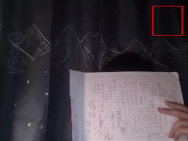

## Task1:在复杂环境中识别绿色三角形的代码分析
### 源文件取自’detect-green-triangle.py‘
- 1.**首先读取图像**
- 2.**将图像由rgb图像转化为hsv图像(更好的进行颜色分离方便接下来对于绿色的提取)**
- **hsv图像如下：**
   
- 3.**创建掩码以提取绿色图像**
- 4.**形态学操作对图像进行去噪处理，方便准确提取三角形轮廓**
- 5.**最后遍历各矩形轮廓，对所得轮廓进行识别并通过对三角形形状特征的提取最后成功得到绿色的三角形并标识出绿色三角形所在坐标**
- **最后所得结果如下：**
   
***运行：*** python3 detect-green-triangle.py
## Task2:Ros2与Opencv的转化同时绘制红色矩形
***运行：*** ros2 run image_change image_change_node
- **运行过程：**
  首先订阅摄像头的图像话题，然后将ros2图像转化为opencv图像并根据cv2.rectangle函数在图像右上角画出一个红色的矩形，最后创建一个发布者发布处理后的图像话题
- **运行结果如下**
- 

